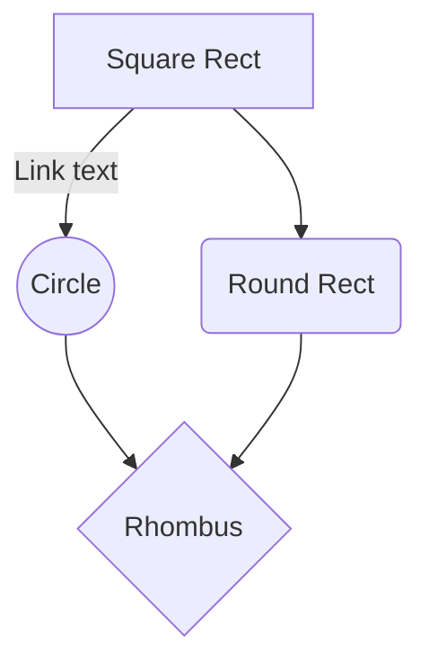

Mermaid:
https://mermaidjs.github.io/#/flowchart

--%3E%7CRJ45%7CE%0AA1(Alim%205V%20micro%20USB)--%3EE(Player%20Audio%20raspi)%0Aend%0Asubgraph%20Salle%20de%20jeu%0AE--%3E%7Ccable%20audio%7CF(HP%20amplifi%C3%A9%201)%0AA2(Alim%20PC16)--%3EF%0AF-.-%3E%7Ccable%20audio%7CG(HP%20amplifi%C3%A9%202)%0AA3(Alim%20PC16)--%3EG%0AW1(Webcam%20D5020L)%0AR1(Arriv%C3%A9e%20RJ45)--%3EW1%0AA4(Alim%20PC16)--%3EW1%0Aend%0A%20%20%20%20%20%20) 

![fuu](data:image/png;base64,iVBORw0KGgoAAAANSUhEUgAAAFEAAABRCAYAAACqj0o2AAAC2ElEQVR4Xu3aMUtqYQDG8cdABZdwL2iJxGaFJKToOyQqBA1uBSKGm0pDEEEZNoWhbYJohuBkTg1hTSEEfY8oQijOy70R0XA6PVyU+7hEeN4Hzo+/noZcAN6g168EXBbi25scnSq6XC4I0anen3NC/CWgdVyIQiQIECZUohAJAoQJlShEggBhQiUKkSBAmFCJQiQIECZUohAJAoQJlShEggBhQiUKkSBAmFCJQiQIECZUohAJAoQJlShEggBhQiUKkSBAmFCJQiQIECZUohAJAoQJlShEggBhQiUKkSBAmBi7EqvVKnZ2dsytPT09we12w+PxmN8PDg6wublp+7avr6/h9/uxuLho+4yTC8cO8fNN5PN5AxCLxZzcG6zzgUAAiUTC0Xm7hyYK0frn/KOjI5TLZQSDQfNzdnYWa2tr2N3dxcrKCprNJs7Pz+Hz+XB5eWlKzmQyKBaLdk1+fN1EIbZaLTQaDVQqFdzd3aFUKuHi4gI3NzfI5XLodDpYXl5GvV43yCoRMAifP87JZBKpVMoUZ70WFhYwGAwwPT2N7e1tPD4+Ymlp6aM6IX6DGI1GMRwOMTU1ZRBfX19xf3+Pubk53N7eIhwOG8j5+XnzvhC/QbQeEOl02mB9fW1sbODl5QUzMzM4PDwU4l+grx9n67uu2+3i5OQEz8/PqNVqyGaz6Pf7Bq7dbmN1dRXHx8cIhULY3983D5atra2PP5N+/NSwcWCiHiyj0cgAnZ2dwev1Ym9vz3w/RiIRnJ6eGrirqyvzpO71enh4eMD6+jri8TgKhYINDmeXjDWis1v696eESDAXohAJAoQJlShEggBhQiUKkSBAmFCJQiQIECZUohAJAoQJlShEggBhQiUKkSBAmFCJQiQIECZUohAJAoQJlShEggBhQiUKkSBAmFCJQiQIECZUohAJAoQJlShEggBhQiUKkSBAmFCJQiQIECZUIhORsPVfT7wDa9/vELhhZQgAAAAASUVORK5CYII=) 

  

 custom_mark10 digraph G { size ="4,4"; main [shape=box]; main -> parse [weight=8]; parse -> execute; main -> init [style=dotted]; main -> cleanup; execute -> { make_string; printf}; init -> make_string; edge [color=red]; main -> printf [style=bold,label="100 times"]; make_string [label="make a string"]; node [shape=box,style=filled,color=".7 .3 1.0"]; execute -> compare; } custom_mark10

