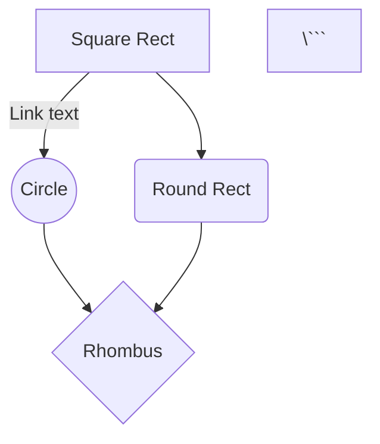

# Liste des sphères

Ci-dessous, la liste des Sphères. 
Elles sont réparties par thématiques, ce qui ne limite en rien le choix des personnages. 

# Mermaid

Mermaid est un outil JavaScript permettant de générer des images de diagrammes à partir d'une structure texte assez compréhensible.
Il permet de générer une image représentant le graphe des Facettes dans la représentation des Sphères. 

Documentation : https://mermaidjs.github.io/#/flowchart

Exemple :
```

